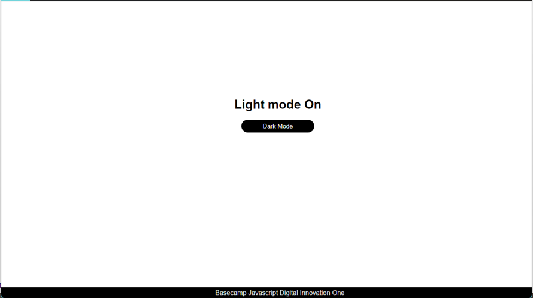

### Light and Dark mode
 
#### First JavaScript projects
 
#### Manipulating the DOM

## About

- Used class switching to handle the dom

## Features

- Change the theme color for dark or light mode

